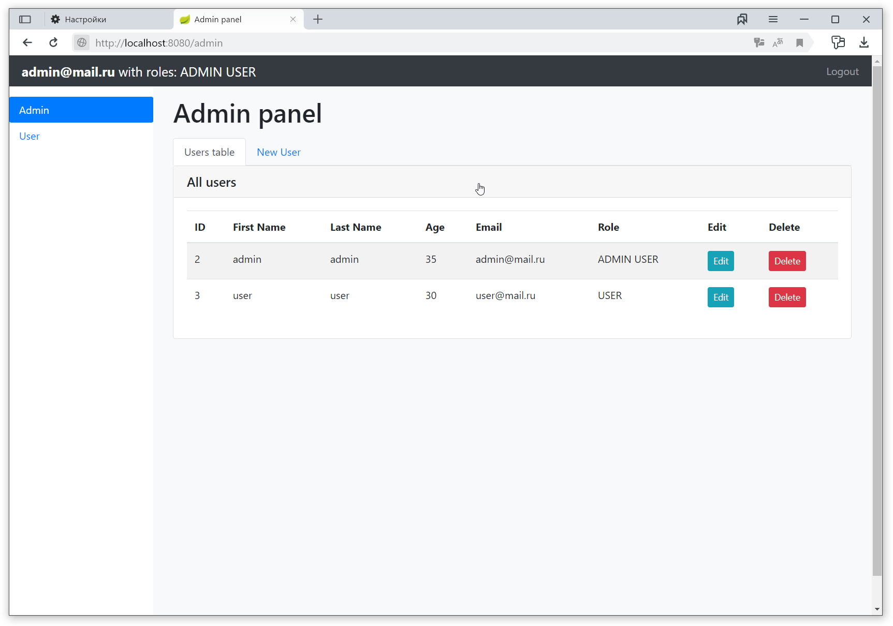
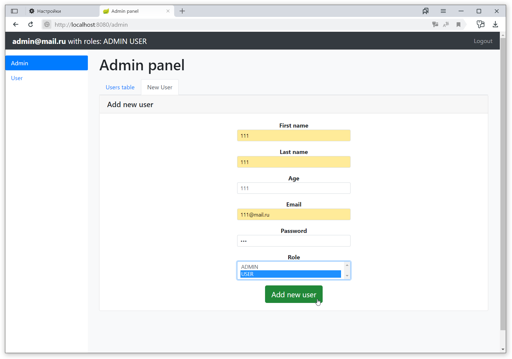

## Практическая задача
### Условие:
Склонируйте проект по ссылке и просмотрите его.

Модуль Spring Security позволяет нам внедрять права доступа, а также контролировать их исполнение без ручных проверок.
Spring Security базируется на 2х интерфейсах, которые определяют связь сущностей с секьюрностью: UserDetails и GrantedAuthority.
UserDetails - то, что будет интерпретироваться системой как пользователь.
GrantedAuthority - сущность, описывающая права юзера.
Оба эти интерфейса имеют множество реализаций: просмотрите класс WebSecurityConfig, в методе configure() с помощью настроек userDetailsService() мы собираем единственный на всю программу экземпляр UserDetails с именем и паролем user , а его роль “USER” так же будет преобразована в экземпляр GrantedAuthority.

Это простейший способ создания секьюрности. Так же мы можем использовать jdbc-аутентификацию путем написания запроса, возвращающего пользователя и роль.
Как вы понимаете, такие способы максимально просты, но лишены достаточной гибкости, потому наиболее часто используемый вариант настройки выглядит как имплементация UserDetails и GrantedAuthority в классах-сущностях с переопределением существующих методов.

#### Задание:
1. Изменить страницы вашего приложения в соответствии со скриншотами, используя Bootstrap.

